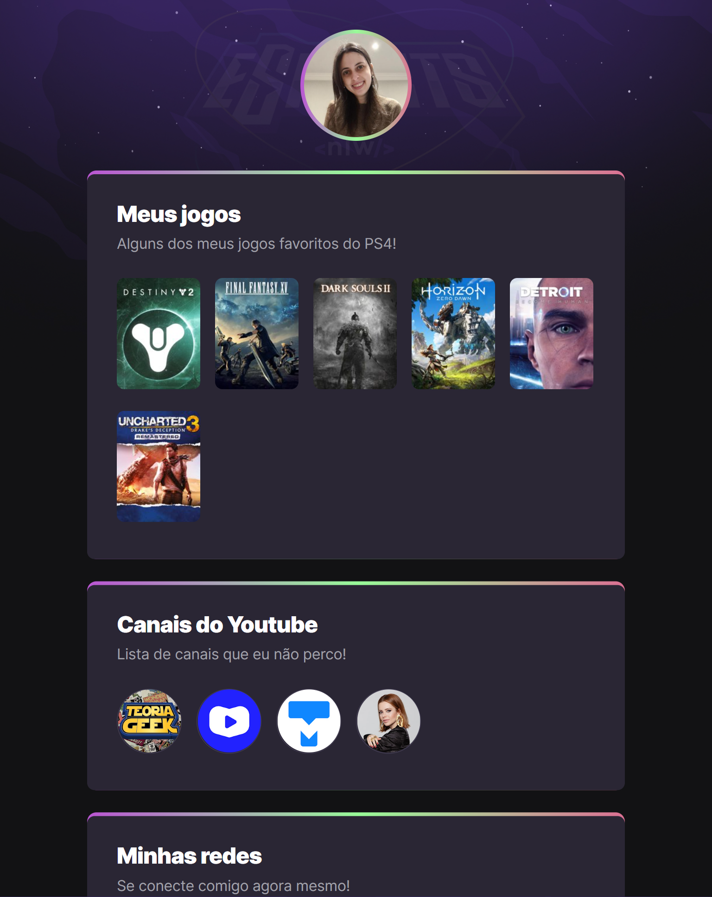

# NLW eSports

>Trilha Explorer

Projeto construído no evento Next Level Week da Rocketseat.

[🔗 Clique aqui para acessar](https://alinelourenco.github.io/nlw-esports/)

## 💻 Tecnologias
- HTML
- CSS
- Git e Github

## O que aprendi:
Esse desafio serviu para eu fixar alguns conceitos de CSS, aprender a organizar melhor o meu portfólio e perceber que estou pronta para tentar desafios maiores.

## 👩🏻‍💻 Contato

alinelaurentius@gmail.com
